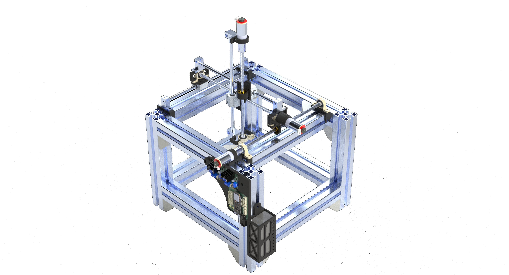

# Cartesian Robot (PPP) ROS2



Robot cartesiano de 3 DOF con ROS2,

## Software y Hardware

<details>
    <summary>Software</summary>

* [ROS2 Jazzy](https://index.ros.org/p/desktop_full/#jazzy)
* [Gazebo Harmonic](https://gazebosim.org/docs/harmonic/getstarted/)
* [uROS Jazzy](https://github.com/micro-ROS/micro_ros_setup/tree/jazzy)
* [uROS Arduino Jazzy](https://github.com/micro-ROS/micro_ros_arduino/tree/jazzy)
* [KiCad](https://www.kicad.org)

</details>

<details>
    <summary>Componentes electrónicos</summary>

* 1 [ESP32 S3 WROOM 1 N16R8 DevKit](https://www.amazon.com/HiLetgo-ESP32-S3-ESP32-S3-DevKit-Bluetooth-Development/dp/B0CDWXWXCG)
* 2 [Módulos controladores de motores L298N](https://www.amazon.com/WWZMDiB-L298N-H-Bridge-Controller-Raspberry/dp/B0CR6BX5QL)
* 3 [Motores con encoder JGA25-371](https://www.amazon.com/JGA25-371-Encoder-Mounting-Bracket-Reduction/dp/B0CGLSGSZ7)
* 4 [LEDs 5730](https://www.amazon.com/AEDIKO-Lighting-Electronics-Components-Emitting/dp/B09XB5KDWS)
* 4 [Resistencias 220 Ohms 1206](https://www.amazon.com/Chanzon-Resistor-Tolerance-Resistors-Certificated/dp/B08R8CW7TX)
* 1 Fuente de alimentación 12V 2A

</details>

<details>
    <summary>Componentes mecánicos</summary>

* 12 perfiles de aluminio de 45x45x300 mm.
* 16 ángulos de aluminio de 45x45 mm.
* 3 tuercas de latón T8.
* 3 tornillos sin fin de 8x300 mm.
* 3 varillas lisas de 8x300 mm.
* 3 rodamientos SC8UU.
* 3 acopladores flexibles de 5x8 mm.
* 5 chumaceras KP08.
* 6 soportes SK8.
* Piezas impresas en 3D.

</details>

## Reportes

La presentación de este proyecto se dividio en dos partes. El reporte del primer avance del proyecto se encuentra en la carpeta [reports](reports/avance 1.pdf) y la presentación en la carpeta [presentations](presentations/avance 1.pdf). El segundo avance del proyecto se encuentra en la carpeta [reports](reports/final.pdf) y la presentación en la carpeta [presentation](presentation/final.pdf).

## Instalación
Para instalar el software de ROS2 Jazzy, se recomienda seguir la guía oficial de instalación de [ROS2](https://docs.ros.org/en/jazzy/Installation/Ubuntu-Install-Debs.html), el siguiente script instala el software de ROS2, Gazebo sim y micro-ROS en Ubuntu:

```shell
$SHELL ./src/install-ros.sh
```


Más información sobre el script en [src](src).

## Espacio de Trabajo de ROS2
Dentro de la carpeta ros-ws se encuentra el paquete en desarrollo `carobot`, el cual contiene los archivos para la visualización y simulación del robot cartesiano en Gazebo y RViz.

### Construcción del espacio de trabajo

```shell
cd ros-ws
colcon build
```

### Ejecución del lanzador

```shell
source install/setup.$(echo $SHELL | awk -F '/' '{print $NF}')
ros2 launch carobot display.launch.py
```

### Ejecución de la interfaz de usuario

```shell
source install/setup.$(echo $SHELL | awk -F '/' '{print $NF}')
ros2 run carobot pos_put.py
```

[ros-ws](ros-ws) contiene más información sobre el espacio de trabajo de ROS2.

## Electrónica


[electronic](electronic) contiene el diseño de la PCB del robot cartesiano en formato KiCad, el cual incluye el diseño de la PCB y el esquema eléctrico.

## Modelado 3D


[CAD](CAD) contiene todos los archivos de diseño 3D del robot cartesiano, incluyendo los archivos `SLDRT` y `SLDASM` de las piezas y ensambles hechos en SolidWorks, así como los archivos `STL` para la impresión 3D de las piezas y la visualización del robot en RViz y Gazebo. Los archivos `STL` se encuentran en la carpeta `STL`, mientras que los archivos `SLDRT` y `SLDASM` se encuentran en la carpeta `piezas` y `ensambles` respectivamente. 

La carpeta también contiene planos de cada pieza y renderizados del robot cartesiano. Los planos se encuentran en la carpeta `planos` y los renderizados en la carpeta `capturas`.
