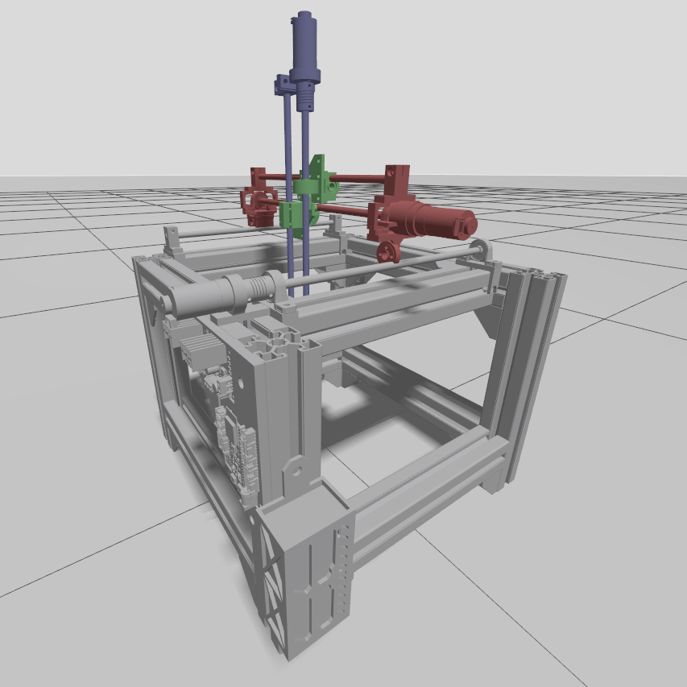
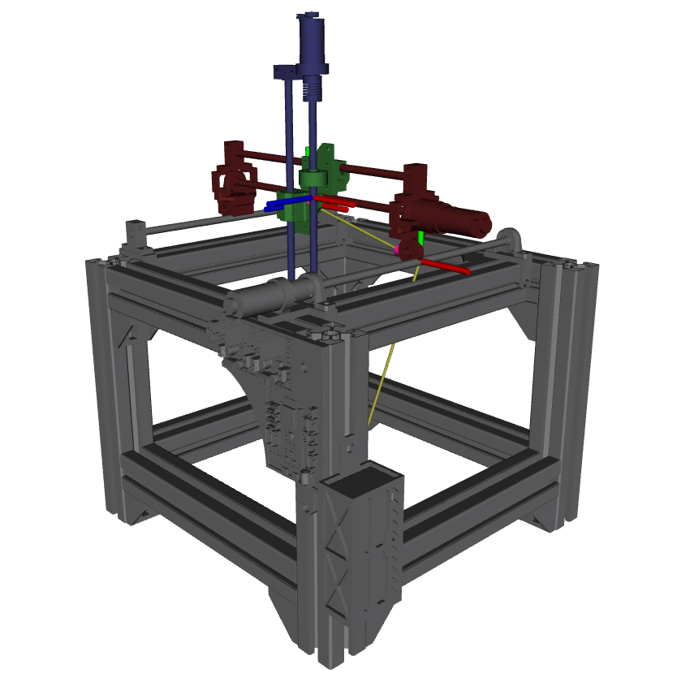

# Espacio de trabajo de ROS2

## carobot
El paquete `carobot` es un paquete de ROS2 para visualizar y simular el robot usando RViz2 y Gazebo. Este paquete incluye un modelo de robot y un archivo de lanzamiento.

### URDF
El modelo del robot se encuentra en el archivo `src/carobot/urdf/model.urdf`. Este archivo describe la geometría y la cinemática del robot. Las mallas usadas en el modelo se encuentran en la carpeta `src/carobot/urdf/meshes`. El archivo `model.urdf` es un archivo XML que describe el modelo del robot. Este archivo es usado por RViz2 y Gazebo para visualizar el robot.

### Lanzador
El archivo de lanzamiento `src/carobot/launch/display.launch.py` emplea los siguientes paquetes:

* `urdf_launch`: Carga el modelo del robot en RViz2.
* `ros_gz_sim`: Carga el modelo del robot en Gazebo a través de un tópico de ROS2 `/robot_description`.
* `ros_gz_bridge`: Crea un puente entre ROS2 y Gazebo para enviar datos de posición desde ROS2 y recibir datos de posición desde Gazebo. Este paquete es necesario para que el robot se mueva en Gazebo y para que los datos de posición se envíen a RViz2.
* `gz sim`: Abre un mundo vacío en Gazebo. Este mundo es usado para simular el robot.

### Scripts

#### pos_put.py
El archivo `src/carobot/src/pos_put.py` se encarga de leer los datos de posición deseados desde la terminal y enviarlos al robot. Este archivo usa el paquete `rclpy` para crear un nodo de ROS2 que se encarga de enviar los datos de posición al robot como `float64`.

#### pos_get.py
El archivo `src/carobot/src/pos_get.py` se encarga de leer los datos de posición del robot desde Gazebo y enviarlos a RViz2. Este archivo lee la posición de cada junta (`JointState`) del robot y la convierte en un mensaje con las posiciones de todas las juntas a un tópico de ROS2 `/joint_states`.

### Gazebo

Al archivo URDF se le añadieron los siguientes plugins dentro de una etiqueta `<gazebo>`:

* `gz-sim-joint-state-publisher-system`: Este [plugin](https://gazebosim.org/api/sim/9/classgz_1_1sim_1_1systems_1_1JointStatePublisher.html) se encarga de publicar la posición de cada junta del robot en un tópico de gazebo puenteado a ROS2 `/world/empty/carobot/joint/prismatic_i_joint/state`. 
* `gz-sim-joint-position-controller-system`: Este [plugin](https://gazebosim.org/api/sim/9/jointcontrollers.html) se encarga de controlar la posición de cada junta del robot. Este plugin es necesario para que el robot se mueva en Gazebo. El plugin recibe los datos de posición desde el tópico `/world/empty/carobot/joint/prismatic_i_joint/cmd_pos` para aplicar un control de posición a la junta.

### RViz2

El archivo `src/carobot/launch/display.launch.py` carga el modelo del robot en RViz2. Este archivo usa los paquetes `urdf_launch` y los tópicos `/robot_description` y `joint_states` para cargar el modelo del robot  y mover el robot en RViz2 respectivamente. 
